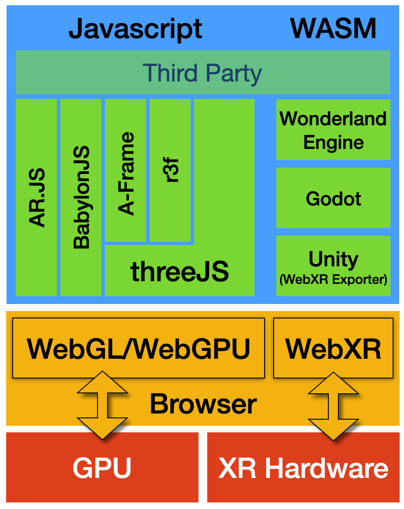
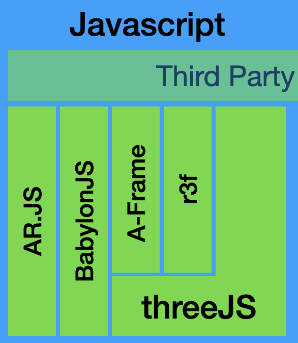

# WebXR

Austin Godber

@godber

webvr.dev


## What is WebXR

3D content delivered over the web, consumed in an immersive environment, like
an AR camera app or a VR headset.


There is a slight distinction from 3D content delivered over the web, that you
interact with inside your 2D browser window.


Consider the difference between two websites that sell hats:

* A traditional site may show a 3D model of the hat in your browser window.
* A WebXR site would use your camera and display that hat on your head.


## Why the Web?

* Low friction
  * Immersive with 2D fallback
  * Distribution is easier
  * Source easily shared and copied
* The web eats everything
* Lots of cases where it's a bad choice


...


I already bought the domain.


# Foundation


Several browser APIs help form the foundation of an immersive web experience:

* **WebXR** - enables browser access to XR Hardware
* **WebGL** - enables browser access to GPU Hardware
* **WebGPU** - enables improved browser access to GPU Hardware





## WebXR Device API

> WebXR is an API for web content and apps to use to interface with mixed reality hardware such as VR headsets and glasses with integrated augmented reality features.

-- [MDN](https://developer.mozilla.org/en-US/docs/Web/API/WebXR_Device_API/Fundamentals#what_webxr_is_and_isnt)


* WebXR spec
    * https://www.w3.org/TR/webxr/
* MDN WebXR Docs
    * https://developer.mozilla.org/en-US/docs/Web/API/WebXR_Device_API


Note that the WebXR  API effectively replaces an older WebVR API that was never
standardized.


## WebGL/WebGL2 APIs

> WebGL (Web Graphics Library) is a JavaScript API for rendering 
> high-performance interactive 3D and 2D graphics within any compatible web
> browser without the use of plug-ins.

-- [MDN](https://developer.mozilla.org/en-US/docs/Web/API/WebGL_API)


API supported by major browsers

* `v1` - 2011 ([link](https://www.khronos.org/registry/webgl/specs/latest/1.0/))
    * OpenGL ES 2.0 on HTML 5
* `v2` - 2017 ([link](https://www.khronos.org/registry/webgl/specs/latest/2.0/))
    * OpenGL ES 3.0 on HTML 5
    * **Extends** `v1`
* MDN WebGL Docs
    * https://developer.mozilla.org/en-US/docs/Web/API/WebGL_API


All sensible modern browsers support WebGL2 at this point.

You can test yours here:
https://get.webgl.org/webgl2/


You can write WebGL v1/v2 code directly, but you do so by writing GLSL code, a
low level language understood by GPUs, wrapped in Javascript.

I think most people use higher level options we'll discuss later.


Here are two great resources for exploring the "bare" WebGL route:

* https://webglfundamentals.org/
* https://webgl2fundamentals.org/


## WebGPU API


*Currently in Working Draft status*


> WebGPU exposes an API for performing operations, such as rendering and
> computation, on a Graphics Processing Unit.

* https://www.w3.org/TR/webgpu/


I think this is what we will all be using in 2-5 years., but is still a draft,
only barely implemented.

The `v5` BabylonJS framework currently supports it experimentally.


## Things to keep in mind

WebXR is a combination of:

* 3D Graphics Programming
* Immersive UIs and hardware


All of these options offer a route to learning 3D Graphics Programming and this
is the first core challenge.


Immersive UI/UX is the second.


# Tools


Your options for building an immersive experience on the web include:

* Direct WebGL Implementation
* Javascript WebXR Framework
* Export WebGL from a Game Engine
    * Unity, Unreal?, Godot
    * Wavering support
* WebXR Engines?
    * https://wonderlandengine.com/


We're going to concentrate the Javascript/HTML Frameworks.





## Javascript WebXR Frameworks

* `three.js`
    * `A-Frame`
    * `react-three-fiber` (`r3f`)
    * `LunchboxJS` (`vue`)
* `babylonjs`
* `ar.js`
* Likely many more, including commercial options.


## Threejs

<?xml version="1.0" encoding="UTF-8"?>
<svg width=100 height=100 style="float:left" fill="none" stroke-linecap="square" stroke-miterlimit="10" version="1.1" viewBox="0 0 226.77 226.77" xmlns="http://www.w3.org/2000/svg">
 <g transform="translate(8.964 4.2527)" fill-rule="evenodd" stroke="#000" stroke-linecap="butt" stroke-linejoin="round" stroke-width="4">
  <path d="m63.02 200.61-43.213-174.94 173.23 49.874z"/>
  <path d="m106.39 50.612 21.591 87.496-86.567-24.945z"/>
  <path d="m84.91 125.03-10.724-43.465 43.008 12.346z"/>
  <path d="m63.458 38.153 10.724 43.465-43.008-12.346z"/>
  <path d="m149.47 62.93 10.724 43.465-43.008-12.346z"/>
  <path d="m84.915 125.06 10.724 43.465-43.008-12.346z"/>
 </g>
</svg>

A scenegraph based Javascript framework for making 3d & VR webapps using WebGL and WebXR:


### Three.js References

* https://threejs.org
* [docs](https://threejs.org/docs/index.html#manual/en/introduction/Creating-a-scene)
* [examples](https://threejs.org/examples/#webgl_animation_keyframes)
* [fundamentals](https://threejs.org/manual/#en/fundamentals)
    * I'd start here.


### Threejs Fundamentals


## `index.html` file

```html
<!DOCTYPE html>
<html>
    <head>
        <meta charset="utf-8">
        <title>My first three.js app</title>
        <style>
            body { margin: 0; }
        </style>
    </head>
    <body>
        <script src="./three.min.js"></script>
        <script type="module" src="./main.js"></script>
    </body>
</html>
```


## `main.js` file

```js
import { VRButton } from './jsm/webxr/VRButton.js';

const scene = new THREE.Scene();
const camera = new THREE.PerspectiveCamera(
    75, window.innerWidth / window.innerHeight, 0.1, 1000
);

const renderer = new THREE.WebGLRenderer();
renderer.setSize( window.innerWidth, window.innerHeight );
document.body.appendChild( renderer.domElement );

document.body.appendChild(VRButton.createButton(renderer));
renderer.xr.enabled = true;
```


## `main.js` file (continued)

```js
const geometry = new THREE.BoxGeometry();
const material = new THREE.MeshBasicMaterial(
    { color: 0x00ff00 }
);
const cube = new THREE.Mesh( geometry, material );
scene.add( cube );
camera.position.z = 5;

const animate = function () {
    cube.rotation.x += 0.01;
    cube.rotation.y += 0.01;
    renderer.render( scene, camera );
}
renderer.setAnimationLoop(animate);
```


<section>
<div><iframe height="600px" width="800px" src="./ex/threejs/index.html"></iframe></div>
</section>


## Aframe

> A-Frame is not just a 3D scene graph or a markup language; the core is a powerful entity-component framework that provides a declarative, extensible, and composable structure to three.js.

-- A-Frame Introduction


```html
<html>
  <head>
    <script src="https://aframe.io/releases/1.2.0/aframe.min.js"></script>
  </head>
  <body>
    <a-scene>
      <a-box position="-1 0.5 -3" rotation="0 45 0" color="#4CC3D9"></a-box>
      <a-sphere position="0 1.25 -5" radius="1.25" color="#EF2D5E"></a-sphere>
      <a-cylinder position="1 0.75 -3" radius="0.5"
        height="1.5" color="#FFC65D"></a-cylinder>
      <a-plane position="0 0 -4" rotation="-90 0 0"
        width="4" height="4" color="#7BC8A4"></a-plane>
      <a-sky color="#ECECEC"></a-sky>
    </a-scene>
  </body>
</html>
```


<section>
<div><iframe height="600px" width="800px" src="./ex/aframe/index.html"></iframe></div>
</section>


## r3f - React 3 Fiber

> React-three-fiber is a React renderer for three.js.

https://docs.pmnd.rs/react-three-fiber/getting-started/introduction


## LunchboxJS

> LunchboxJS (or just Lunchbox) is a Vue 3 custom renderer for Three.js.

https://docs.lunchboxjs.com/


## babylon.js

Batteries Included WebXR framework.

* https://www.babylonjs.com/
* https://doc.babylonjs.com/journey/theFirstStep
* https://www.babylonjs.com/demos/webgpu/forestwebgpu


Features:

* Animation Curve Editor
* Performance Profiler
* GUI Editor
* WebGPU Support
* Native Support Options


## babylon.js - spector

> A complete engine agnostic JavaScript framework for exploring and
> troubleshooting your WebGL scenes with ease

https://spector.babylonjs.com/


# Other


## Physics

There are a number of "game physics" and animation type libraries:

* `ammo.js`
* `canon.js`??


## PWA on Oculus

It's possible to create a Native Oculus Quest App using WebXR Technology

https://timmykokke.com/blog/2021-11-05-webxr-pwa-apk/

